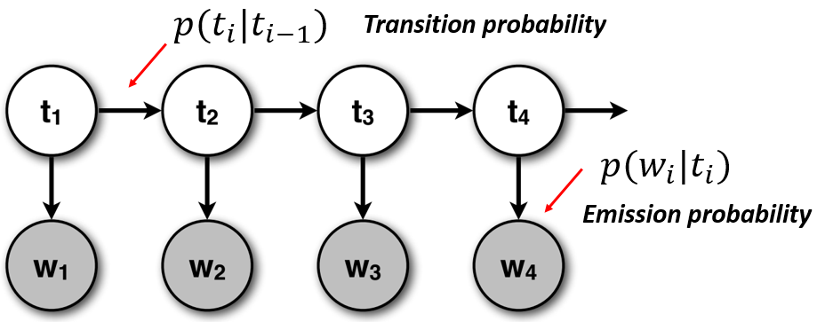
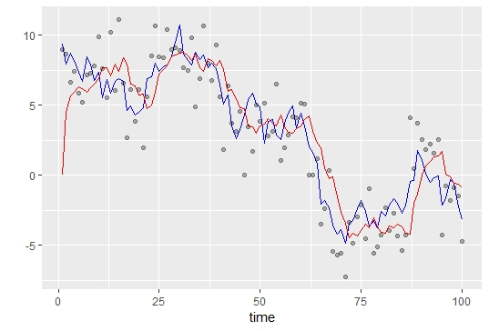

# Introduction

## Motivation

We want to forecast currency exchange rates while building a richer model. Standard time series forecasting methods do not assume latent states, which is unsatisfying from a theoretical perspective.

Suppose we have three currencies: GBP, USD, JPY. Then the observed exchange rates are GBPUSD, GBPJPY, USDJPY, and their reciprocals (we assume zero spread). There are two notations for exchange rates, so we must clarify. When we say USDJPY = 100, we mean that 1 USD can be exchanged into 100 JPY. 

We can treat them as separate time series. However, the forecasts might imply arbitrage opportunities. Suppose we forecast USDJPY = 100, JPYGBP = 0.01, and GBPUSD = 1.5. Then writing them as fractions we get

$$\frac{USD}{JPY} \times \frac{JPY}{GBP} \times \frac{GBP}{USD} = 100 \times 0.01 \times 1.5 = 1.5$$

We want this to equal 1 for any combination of forecasts. Otherwise, in this scenario, we can get risk-free profit by going through the cycle $USD \implies JPY \implies GBP \implies USD$ gaining 50% profit in each iteration.

One way to satisfy the no-arbitrage constraint is to model the currencies explicitly. We think there is some kind of intrinsic value for GBP, USD, and JPY, and the observed ratios are ratios of some hidden values. Previously, even though $\frac{USD}{JPY}$ is written as a fraction, it is a single variable; the fraction is notational convenience. We want the fraction to be an actual fraction of two variables so the variables can "cancel out" and evaluate to 1.

We choose to forecast the log of the exchange rates, so $log(\frac{USD}{JPY}) = log(USD) - log(JPY)$. This has two major benefits. First, we can express observations as linear combinations of hidden variables, and linear models are much easier to estimate than multiplicative ones. Second, we can explicitly model USD and JPY as geometric Brownian motion.

The second part has some subtleties. We cannot model $X = log(\frac{USD}{JPY})$ as Brownian motion $X_{t+1} - X_t \sim \mathcal N(0, \sigma^2)$ because that implies the exchange rate will keep going up. Recall that if $Y \sim \mathcal N(\mu, \sigma^2)$, then $\mathbb E[e^{Y}] = e^{\mu + \frac 12 \sigma^2} > 1$. This leads to problems:

* If both $log(\frac{USD}{JPY})$ and $log(\frac{JPY}{USD})$ are Brownian motion with zero drift, then both exchange rates will go up over time, which is absurd.
* If we only model $log(\frac{USD}{JPY})$ as Brownian motion and ignore the exchange rate going the other direction, then we are asserting a deterministic trend where USD becomes more and more valuable than JPY as time passes.
* If we add a drift term (i.e. $\mu \neq 0$) to one of the exchange rates, we are likewise asserting a deterministic trend unless we set $\mu = - \frac 12 \sigma^2$.

None is palatable. But allowing both $log(USD)$ and $log(JPY)$ go up in value over time is perfectly reasonable. For instance, if USD goes up slower than JPY, but both are going up, then the exchange rate USDJPY will go down. Therefore, allowing an individual currency to be geometric Brownian motion leads to a consistent model. Furthermore, we will be able to tell at a glance which currencies are strengthening or weakening by plotting the latent states over time.

## Data

We obtained 1-minute interval exchange data from __[Philippe Remy's Github](https://github.com/philipperemy/FX-1-Minute-Data)__ and limited ourselves to five currencies (USD, GBP, JPY, EUR, AUD) in May 2019. Some observations are missing, but we believe the missing observations mean the exchange rate has not changed from the last minute, so we impute by carrying the last value forward. Longer periods of missing data (such as over a weekend) are due to the markets being closed, and we accept that no observations are possible. Hence, we limit ourselves to a single week without any weekends inbetween the observations.

# (Adaptive) Kalman Filter

The model assumes there are some latent variables of interest and our observations are linear combinations of them. Let x be the latent states and y be the observed values. For our purposes, x is the log of the currency intrinsic values while y is the log of the exchange rates. Then the model is succinctly stated as

$$x_{t+1} = A x_{t} + u_t$$
$$y_{t+1} = B x_{t+1} + v_t$$
$$u \sim MVN(0, \Sigma_p)$$
$$v \sim MVN(0, \Sigma_m)$$

For Brownian motion, A is the identity matrix so we ignore it. Under these assumptions, the Kalman Filter is the optimal estimator. We will see why once we connect it to Bayesian statistics. When the $u_t$ and $v_t$ are non-Gaussian, then only approximations exist, often through the Unscented Kalman Filter or Particle Filtering (also known as Sequential Monte Carlo). We will limit ourselves to the Gaussian assumption.

Before we go in depth, we develop the intuition.

## What is a Filter?

A filter only sees past and current data and does not know of the future, but we must make the best guess given our current information. Contrast this with smoothing, which uses future information to make inferences about the present. If we use moving averages, then a sliding window from $t-2$ to $t$ is a filter, while a sliding window from $t-2$ to $t+2$ is a smoother. Visually, a filter looks similar to a smoother. In this illustration, the blue line is the observed values, while the red line is the filtered values.


## Continuous State Space Model

Many people are familiar with Hidden Markov Models.



__[<center>Image source</center>](http://www.davidsbatista.net/blog/2017/11/11/HHM_and_Naive_Bayes/)__

A Kalman Filter is like the continuous analog of the HMM. The first equation governs the transition of the hidden states, while the second equation governs the emissions.

The Kalman Filter is used for GPS navigation. Your GPS sends signals (measurements) but they are noisy and the system has to guess your car's true position (latent state). The continuity has two important implications:

* Your car's location isn't restricted to only a few possible states; it can be anywhere on the globe.
* Your car cannot teleport. If for the past hour the measurement comes from New York and the next minute the signal comes from California, we want to keep our estimate close to New York.

Likewise, for our currency model, we don't allow for our currency values to teleport. When reading this report, imagine that the currency intrinsic values are vehicles and the observed exchange rates are GPS readings.

## Connection to Normal-Normal Conjugacy

Consider a univariate random walk with increments $\mathcal N(0, \sigma^2_p)$ and our measurements have an error $\sim \mathcal N(0, \sigma^2_m)$. The prediction variance $s^2_t$ determines the width of our prediction interval.

Then the Kalman Filter reduces to (almost) a Normal-Normal conjugacy relationship with unknown mean:

$$\mu_{t+1} = \frac{\frac{1}{\sigma^2_p} \mu_t + \frac{1}{s^2_t} y}{\frac{1}{\sigma^2_p} + \frac{1}{s^2_t}}$$       
$$s^2_{t+1} = \frac{1}{\frac{1}{\sigma^2_p} + \frac{1}{s^2_t}} + \sigma^2_m$$

The Kalman Filter is the optimal estimator because it gives us the posterior mode = mean = median. We cannot do any better.

If $\mu$ is a time-invariant constant, the posterior variance should get smaller with each additional observation. However, because $\mu$ changes constantly, we need to remain uncertain at all times; the $\sigma^2_m$ term prevents the posterior variance from going to 0 as $n \to \infty$.

Here's a simple example. Red is the predictions from the filter, blue is the true state, and dots are our measurements. We initialize starting point at 0 and are told the true hyperparameters $\sigma^2_m = 2$ and $\sigma^2_p = 1$.




## Parameter Estimation

In virtually all real-world cases, the variances are unknown hyperparameters. The performance of the filter, like most machine learning models, depends heavily on the selected hyperparameters.

Astute readers might note that, in the univariate case, the only thing that matters is the ratio $\frac{\sigma^2_m}{\sigma^2_p}$ or its reciprocal. Likewise, for the multivariate case, the simplest model is to set $\Sigma_m = I_m$ and $\Sigma_p = \tau I_p, \tau \in \mathbb R^+$ and the problem reduces to estimating a single parameter. The next step up in complexity is to use the mean-field variational family: diagonal covariance matrices where we estimate each diagonal element separately.

However, a priori, this is too simple. We expect some currencies to be more stable than others, and exchange rates with the same underlying currency should be correlated with each other. In ADVI, it is noted that financial assets have enough complexity that a full covariance matrix tends to perform much better than the mean-field variational family. Therefore, we want to estimate full-rank matrices.

## Adaptivity

Many financial time series exhibit volatility clustering. For this reason, volatility models like GARCH are popular in finance. We want to capture this dynamic and let the covariance matrices vary over time. $\Sigma_p$ might increase because of changes in government policy. $\Sigma_m$ might increase in times of market uncertainty.

# Challenges

We ended up not using Pyro because, as we found out, this problem is not suited for probabilistic programming. 

## Markov Assumption

Time series models are hard to fit because the likelihood cannot be factored nicely. The most relaxed assumption we can have is at least first-order Markov process. In our case, assuming $\theta$ is all the hyperparameters that are *not* time-varying, the likelihood is

$$ p(Y | X, \theta ) = p(\theta ) p(x_0) \prod_{t=1}^n p(y_t | x_t, \theta ) p(x_t | x_{t-1}, \theta) $$

This has two main issues. First, we cannot evaluate the gradient with respect to $\theta$. The likelihood of the observations can be computed easily when $\theta$ is fixed. However, when $\theta$ changes, so does our estimate of $X$, so it is not clear how a change in $\theta$ might affect the likelihood. Automatic differentiation will have to go through the entire time series at every single pass. An EM approach is better-suited for this kind of problem, where we alternate between estimating $\theta$ while holding $X$ fixed and estimating $X$ while holding $\theta$ fixed. CAVI comes to mind, but we don't really have conditional conjugacy. We need to do EM the old-fashioned way.

Second, we cannot employ stochastic methods because the observations are not exchangeable, even assuming $\theta$ is fixed. With time-varying $\theta$, stochastic methods go out the window.


## Covariance Matrices

As it turns out, inferring covariance matrices is really, really hard. There are three alternative ways to work with covariances: __[LKJ prior](https://docs.pymc.io/notebooks/LKJ.html)__, __[Inverse Wishart prior](https://en.wikipedia.org/wiki/Inverse-Wishart_distribution)__, and __[Cholesky decomposition](https://mc-stan.org/docs/2_19/functions-reference/multi-normal-cholesky-fun.html)__. We opted for the inverse Wishart because it is simple to update using the EM algorithm. If we used VI or MCMC, then the other two options would be better.

# Model Fitting

The pseudocode of the algorithm:

```python
initialize priors with kalman_smoother() on burn-in samples
counter = 1
do:
    iter = 0
    while psis_k < 0.7:
        iter = iter + 1
        forward_pass(data[counter:])
    kalman_smoother(data[counter:(counter + iter)])
    update hyperparameters
    counter = counter + iter
until went through all observations
```

To make the problem tractable, we use the inverse Wishart distribution, which is the distribution of covariance matrices characterized by the $\nu$ degrees of freedom parameter and the $S_{p \times p}$ scale parameter. Intuitively, $\nu$ is the number of observations we pad our prior with, and $S$ is $X^T X$ where $X$ is a $n \times p$ matrix where each row comes from a $MVN(0, \Sigma)$ distribution. The inverse Wishart has mode $\frac{S}{\nu}$ and mean $\frac{S}{\nu - p - 1}$. If this looks like the MLE vs unbiased estimator of variance, you're getting it. Thus, the update is

$$\nu_{t+1} = \nu_t + n$$

$$S_{t+1} = S_t + S_{obs}$$

We didn't really use Pyro so we're going to smile and say we manually implemented CAVI. Because conjugate priors. :) No questions please. It's probabilistic. And has programming.

## Forward Pass

The forward pass estimates the latent variables by supplying a starting point, some observations, and the covariance matrices. We hold hyperparameters fixed and propagate through the system. The calculations are standard and can be found on Wikipedia. We are simply updating our MVN prior with MVN likelihood and then adding some uncertainty at each time step.

## EM Smoothing

Kalman smoothing algorithms provide the best estimates of initial state. However, this will allow currencies to "teleport" from one minibatch to the next. Instead, we use EM to hold the initial state fixed. In the expectation step, we do a forward_pass() to estimate the latent states given the covariances. In the maximization step, we do

$$\hat S_m = (Y-\hat Y)^T (Y-\hat Y)$$

$$\hat S_p = \sum_t (X_t - X_{t-1})^T (X_t - X_{t-1})$$

We iterate EM until convergence and update our inverse Wishart priors using the empirical scale matrices.


## Pareto-Smoothed-Importance-Sampling Leave-Future-Out CV (PSIS-LFO-CV)

PSIS is often used to approximate LOO-CV to assess model fit. PSIS-LFO-CV is a form of approximate LOO-CV for time series models, and the raw importance weights are proportional to

$$r_n^{(s)} \propto \prod_{i=1}^n p(y_{t+i}|\theta^{(s)})$$

Which is the likelihood of the observations given some sampled hyperparameters. In other words, we can sample some covariance matrices and hold them fixed, and given an initial state and some observations, we can go through the forward_pass() and evaluate the likelihood of the observations up to that time point. When the likelihoods start to have infinite variance, our model is becoming unstable because their predictions start to differ wildly, and we have to refit our model. Instead of refitting for the entire past, instead we use the conjugacy of the inverse Wishart to refit only using the data since the last time the model was refitted.

PSIS fits a generalized Pareto distribution to the right tail of the raw importance weights (the highest 20%) with some weakly regularizing prior (because otherwise fitting a GPD can be extremely hard). When the shape parameter $k$ goes above 0.5, the variance of the distribution is infinite. However, in the PSIS-LOO-CV paper, empirically the results are decent until $k > 0.7$, at which point we update our hyperparameters and start a new forward_pass().

# Criticism of Results

Ok, first of all, the model will not run when the dimensions are too high. While it runs for 3 currencies, the predictions become terribly off with 5 currencies.

## Code

### Data loading and preprocessing


```python
import numpy as np
import pandas as pd
from Report_EM import forward_pass
%run Report_preprocessing.py
%run Report_EM.py
```

We took logs for each FX rate and multiply them by 100 to avoid numerical issues.


```python
df.head()
```


<div>
<style scoped>
    .dataframe tbody tr th:only-of-type {
        vertical-align: middle;
    }

    .dataframe tbody tr th {
        vertical-align: top;
    }

    .dataframe thead th {
        text-align: right;
    }
</style>
<table border="1" class="dataframe">
  <thead>
    <tr style="text-align: right;">
      <th></th>
      <th>timestamp</th>
      <th>gbpjpy</th>
      <th>gbpusd</th>
      <th>usdjpy</th>
      <th>time_gap</th>
    </tr>
  </thead>
  <tbody>
    <tr>
      <th>0</th>
      <td>2019-05-01 00:00:00</td>
      <td>497.985989</td>
      <td>26.565883</td>
      <td>471.39349</td>
      <td>1</td>
    </tr>
    <tr>
      <th>1</th>
      <td>2019-05-01 00:01:00</td>
      <td>497.985989</td>
      <td>26.565883</td>
      <td>471.39349</td>
      <td>1</td>
    </tr>
    <tr>
      <th>2</th>
      <td>2019-05-01 00:02:00</td>
      <td>497.985989</td>
      <td>26.565883</td>
      <td>471.39349</td>
      <td>1</td>
    </tr>
    <tr>
      <th>3</th>
      <td>2019-05-01 00:03:00</td>
      <td>497.985989</td>
      <td>26.565883</td>
      <td>471.39349</td>
      <td>1</td>
    </tr>
    <tr>
      <th>4</th>
      <td>2019-05-01 00:04:00</td>
      <td>497.985989</td>
      <td>26.565883</td>
      <td>471.39349</td>
      <td>1</td>
    </tr>
  </tbody>
</table>
</div>


### Running forward pass


```python
training = df.loc[10000:11999, :]

forward_predictions, forward_states, \
    forward_post_covar, forward_innoation_covar = \
    forward_pass(data=training[:100],
                 initial_state=np.array([270, -220, 250]),
                 emit_mat=emit_mat,
                 meas_covar=1 *
                 np.identity(
                 nrow),
                 proc_covar=0.01 *
                 np.identity(
                 nrow),
                 post_covar=0.01*np.identity(nrow))
# Convert to pandas Data Frame
forward_predictions = pd.DataFrame(forward_predictions,
                                   columns=['timestamp'] +
                                   ccy_list + ['time_gap'])
```


```python
%run Report_utils.py
```


```python
gbpusd_dict = {'gbpusd(raw)': training.iloc[20:100, 1].shift(-1),
               'gbpusd(pred)': forward_predictions.iloc[20:100, 1].to_numpy()}
```


```python
plot_multi(pd.DataFrame(gbpusd_dict), figsize=(10,8))
```


    <matplotlib.axes._subplots.AxesSubplot at 0x116e163c8>


### Running Kalman smoother


```python
check_smoother = kalman_smoother(data=training[:1000],
                                 prior_state=np.array(
                                     [270, -220, 250], dtype=np.float64),
                                 emit_mat=emit_mat,
                                 prior_meas_df=100,
                                 prior_meas_scale=1**2 *
                                 np.identity(
                                     emit_mat.shape[1], dtype=np.float64),
                                 prior_proc_df=100,
                                 prior_proc_scale=0.1**2 *
                                 np.identity(
                                     emit_mat.shape[0], dtype=np.float64),
                                 post_covar=forward_post_covar
                                 )
```


```python
gbpusd_dict = {'gbpusd(raw)': check_smoother['input_data'][0:100].loc[:, 'gbpusd'].shift(-1),
                'gbpusd(pred)': check_smoother['predicted_measurements'][0:100][:, -3]}
```


```python
plot_multi(pd.DataFrame(gbpusd_dict), figsize=(10,8))
```


    <matplotlib.axes._subplots.AxesSubplot at 0x1170dd940>


### Adaptive Kalman Filter


```python
%run Report_adaptive_kf.py
```


```python
check_smoother_init = kalman_smoother(
    data=df.loc[19499:19998, :],
    emit_mat=emit_mat,
    prior_state=np.array([0, 0, 0], dtype=np.float64),
    post_covar=10*np.identity(emit_mat.shape[0], dtype=np.float64),
    prior_proc_df=10,
    prior_proc_scale=10*0.1*np.identity(emit_mat.shape[0], dtype=np.float64),
    prior_meas_df=10,
    prior_meas_scale=10*0.1*np.identity(emit_mat.shape[0], dtype=np.float64)
)
```


```python
check_akf = adaptive_kalman_filter(
    data=df.loc[19999:20198, :],
    emit_mat=emit_mat,
    burn_in=0,
    prior_state=check_smoother_init['states'][-1, 1:-1].astype(np.float64),
    prior_covar=check_smoother_init['post_covar'],
    innovation_covar=check_smoother_init['innovation_covar'],
    prior_proc_df=check_smoother_init['post_proc_df'],
    prior_proc_scale=check_smoother_init['post_proc_scale'],
    prior_meas_df=check_smoother_init['post_meas_df'],
    prior_meas_scale=check_smoother_init['post_meas_scale']
)
```


```python
input_data = check_akf['input_data'].iloc[:,:-1]
input_data.iloc[:,1:] = input_data.iloc[:,1:]/100
predictions = pd.DataFrame(check_akf['predicted_meas'], columns=['timestamp'] + ccy_list + ['timegap'])
predictions.iloc[:,1:-1] =predictions.iloc[:,1:-1]/100
plot_df = pd.merge(how='inner',left=input_data, right=predictions, on='timestamp', suffixes=('_raw', '_pred'))
gbpjpy_dict = {'gbpjpy_raw':plot_df.loc[:,'gbpjpy_raw'].shift(-1), 'gbpjpy_pred':plot_df.loc[:,'gbpjpy_pred']}
```


```python
plot_multi(pd.DataFrame(gbpjpy_dict), figsize=(10, 8))
```


    <matplotlib.axes._subplots.AxesSubplot at 0x11859d320>


## Predictive Performance


```python

```


```python

```


```python

```


```python

```


```python

```

## Latent State Estimates

# Criticism of Model

## Computational Complexity

## Serially Correlated Errors

## Variance of the Inverse Wishart Posterior

## Acceleration Term

Minsu

# Conclusion

We started with strong theory and set out to build a model consistent with the theory. Like with many research problems, we didn't know at the start whether or not we'd get a satisfying conclusion. In our case, we are left unsatisfied.

# References

__[ADVI](https://arxiv.org/pdf/1603.00788.pdf)__ Kucukelbir et al. (2016). Automatic Differentiation Variational Inference

__[PSIS](https://arxiv.org/pdf/1507.02646.pdf)__ Vehtari et al. (2019). Pareto Smoothed Importance Sampling

__[PSIS-LOO-CV](https://arxiv.org/pdf/1507.04544.pdf)__ Vehtari et al. (2016) Practical Bayesian model evaluation using leave-one-out cross-validation and WAIC

__[PSIS-LFO-CV](https://arxiv.org/pdf/1902.06281.pdf)__ Bürkner et al. (2019). Approximate leave-future-out cross-validation for Bayesian time series models


